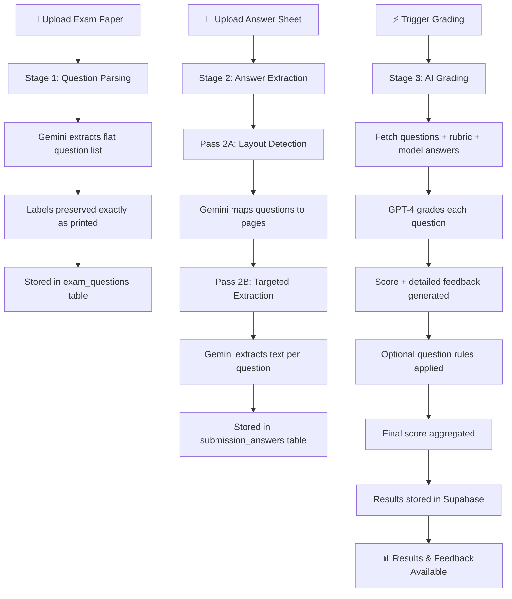

<div align="center">

# 🎓 EvalueX

### EvalueX: A Smart LLM-Based Grading System

</div>

---

## 🌟 Overview

**EvalueX** addresses one of the most time-consuming challenges in academia — **manual examination grading**. By leveraging cutting-edge LLMs (Google Gemini & OpenAI GPT), EvalueX automates the entire evaluation lifecycle from question paper parsing to per-question grading, feedback generation, and score aggregation.

The platform is built on a **modular, scalable, and production-ready architecture** with a clear separation between the React/TypeScript frontend and the Node.js/Express backend, connected via REST APIs and powered by Supabase as the cloud database layer.

### Why EvalueX?

| Problem | EvalueX Solution |
|---|---|
| Manual grading takes hours per exam | AI grades in minutes with per-question breakdown |
| Inconsistent scoring across evaluators | Standardized rubric-based AI evaluation |
| No structured feedback for students | Detailed AI-generated feedback per question |
| Hard to track class-wide performance | Built-in analytics and results dashboard |
| Difficult to manage multiple classes | Class and assignment management system |

---

## ✨ Key Features

- 🤖 **AI-Powered Grading** — Uses Google Gemini and OpenAI GPT to evaluate handwritten and typed answers
- 📄 **Question Paper Parsing** — Automatically extracts and structures questions from uploaded exam PDFs/images
- 📝 **Model Answer Extraction** — Parses model answer sheets and rubrics for reference-based grading
- 🗂️ **Question-Centric Pipeline (QCP)** — Grades each question independently for granular scoring
- 📊 **Score Aggregation** — Computes final scores with optional question policy support
- 🔁 **Re-grading Support** — Educators can trigger re-grading for individual questions
- 📈 **Analytics Dashboard** — Class-wide performance tracking and visual insights
- 🏫 **Class & Assignment Management** — Organize students, classes, and assignments
- 🔐 **Supabase Auth** — Secure email/password and Google OAuth authentication
- 📑 **Feedback PDF Generation** — Auto-generates downloadable feedback reports per student
- 🐳 **Docker-Ready Backend** — Production-ready containerized backend deployment
- 🌙 **Dark/Light Theme** — Full theme support with persistent preference

---

## 🛠️ Tech Stack

### Frontend

| Technology | Version | Purpose |
|---|---|---|
| React.js | 18.x | UI Component Framework |
| TypeScript | 5.x | Type-safe JavaScript |
| Vite | 5.x | Build Tool & Dev Server |
| Tailwind CSS | 3.x | Utility-first Styling |
| Shadcn/UI | Latest | Accessible UI Components |
| React Router DOM | 6.x | Client-side Routing |
| TanStack Query | 5.x | Server State Management |
| Framer Motion | 12.x | Animations |
| Supabase JS | 2.x | Auth & Database Client |
| jsPDF | 4.x | PDF Generation |
| Recharts | 2.x | Data Visualization |

### Backend

| Technology | Version | Purpose |
|---|---|---|
| Node.js | 20.x | Runtime Environment |
| Express.js | 4.x | REST API Framework |
| Supabase JS | 2.x | Database & Storage |
| Google Generative AI | 0.21.x | Gemini LLM Integration |
| OpenAI SDK | 4.x | GPT Integration |
| Multer | 1.x | File Upload Handling |
| pdf-parse | 1.x | PDF Text Extraction |
| pdfjs-dist | 5.x | PDF Processing |
| dotenv | 16.x | Environment Config |
| cors | 2.x | Cross-Origin Requests |

### Infrastructure

| Technology | Purpose |
|---|---|
| Supabase | PostgreSQL DB, Auth, Storage |
| Docker | Backend Containerization |
| Google Gemini 2.5 Flash | OCR, Layout Detection, Answer Extraction |
| OpenAI GPT-4 | Answer Grading & Feedback |

---

## 📁 Folder Structure

```
EvalueX/
│
├── 📂 backend/                              # Node.js + Express REST API Server
│   │
│   ├── 📂 routes/                           # API Route Handlers
│   │   ├── aggregateScores.js               # Score computation & aggregation
│   │   ├── extractAnswers.js                # 2-pass answer extraction pipeline
│   │   ├── extractModelAnswersPdf.js        # Model answer PDF extraction
│   │   ├── extractQuestionsPdf.js           # Question paper PDF extraction
│   │   ├── extractText.js                   # OCR text extraction (backward compat)
│   │   ├── gradeQuestion.js                 # Single question re-grading
│   │   ├── gradeSubmission.js               # Full submission grading pipeline
│   │   ├── parseModelAnswers.js             # Model answer parsing
│   │   ├── parseQuestionPaper.js            # Question paper structure parsing
│   │   ├── parseRubricPdf.js                # Rubric PDF parsing
│   │   └── uploadFeedbackPdf.js             # Feedback PDF upload to Supabase
│   │
│   ├── 📂 services/                         # External Service Integrations
│   │   ├── geminiService.js                 # Google Gemini AI functions
│   │   ├── openaiService.js                 # OpenAI GPT grading functions
│   │   └── supabaseClient.js                # Supabase service-role client
│   │
│   ├── 📂 supabase/                         # Database Schema
│   │   └── schema.sql                       # Full database schema (run once on new Supabase project)
│   │
│   ├── 📂 utils/                            # Shared Utility Functions
│   │   ├── dbHelpers.js                     # Supabase query helpers
│   │   ├── geminiErrors.js                  # Gemini error handling
│   │   ├── multerUpload.js                  # File upload configuration
│   │   ├── optionalQuestionsRules.js        # Optional question policy logic
│   │   ├── pdfParser.js                     # PDF parsing utilities
│   │   ├── sanitize.js                      # Text sanitization
│   │   └── scoreAggregator.js               # Score calculation logic
│   │
│   ├── .dockerignore
│   ├── .env                                 # Environment variables (not committed)
│   ├── .env.example                         # Environment variable template
│   ├── .gitignore
│   ├── Dockerfile                           # Docker container config
│   ├── index.js                             # Express app entry point
│   ├── package-lock.json
│   └── package.json
│
├── 📂 frontend/                             # React + TypeScript SPA
│   │
│   ├── 📂 public/                           # Static assets
│   │
│   ├── 📂 src/
│   │   ├── 📂 components/
│   │   │   ├── 📂 layout/                   # Header, Sidebar, NavLink
│   │   │   ├── 📂 marketing/                # Landing page components
│   │   │   └── 📂 ui/                       # Shadcn/Radix UI components
│   │   │
│   │   ├── 📂 hooks/                        # Custom React hooks
│   │   │   ├── useAuth.tsx                  # Authentication hook
│   │   │   └── useTheme.tsx                 # Theme management hook
│   │   │
│   │   ├── 📂 integrations/
│   │   │   ├── api-client.ts                # Backend REST API client
│   │   │   └── 📂 supabase/                 # Supabase client & types
│   │   │
│   │   ├── 📂 pages/
│   │   │   ├── 📂 auth/                     # Login, Signup
│   │   │   ├── 📂 dashboard/                # Dashboard, Classes, Assignments, Results, Analytics
│   │   │   ├── 📂 grading/                  # Upload, GradingReview, Rubrics
│   │   │   ├── 📂 marketing/                # Landing page
│   │   │   └── 📂 settings/                 # User settings
│   │   │
│   │   ├── 📂 utils/                        # Frontend utilities
│   │   ├── App.tsx                          # Root component & routing
│   │   ├── main.tsx                         # React entry point
│   │   └── index.css                        # Global styles
│   │
│   ├── .env                                 # Frontend env variables (not committed)
│   ├── .env.example                         # Frontend env template
│   ├── .gitignore
│   ├── components.json
│   ├── eslint.config.js
│   ├── index.html
│   ├── package-lock.json
│   ├── package.json
│   ├── postcss.config.js
│   ├── tailwind.config.ts
│   ├── tsconfig.app.json
│   ├── tsconfig.json
│   ├── tsconfig.node.json
│   └── vite.config.ts
│
└── README.md
```

---

## 🚀 Installation & Setup

### Prerequisites

Ensure the following are installed on your system:

| Tool | Version | Download |
|---|---|---|
| Node.js | >= 18.x | [nodejs.org](https://nodejs.org/) |
| npm | >= 9.x | Included with Node.js |
| Git | Latest | [git-scm.com](https://git-scm.com/) |
| Docker (optional) | Latest | [docker.com](https://www.docker.com/) |

### Clone the Repository

```bash
git clone https://github.com/your-username/EvalueX.git
cd EvalueX
```

---

## 🔐 Environment Variables

### Backend — `backend/.env`

Create a `.env` file inside the `backend/` folder:

```env
# Server
PORT=3001

# AI API Keys
GEMINI_API_KEY=your_google_gemini_api_key
OPENAI_API_KEY=your_openai_api_key

# Supabase
SUPABASE_URL=https://your-project-id.supabase.co
SUPABASE_SERVICE_KEY=your_supabase_service_role_key

# Optional
FRONTEND_URL=http://localhost:8080
```

| Variable | Description | Where to Get |
|---|---|---|
| `GEMINI_API_KEY` | Google Gemini API key | [aistudio.google.com](https://aistudio.google.com) |
| `OPENAI_API_KEY` | OpenAI API key | [platform.openai.com](https://platform.openai.com/api-keys) |
| `SUPABASE_URL` | Supabase project URL | Supabase Dashboard → Settings → API |
| `SUPABASE_SERVICE_KEY` | Supabase service role key | Supabase Dashboard → Settings → API |

### Frontend — `frontend/.env`

Create a `.env` file inside the `frontend/` folder:

```env
VITE_API_URL=http://localhost:3001
VITE_SUPABASE_URL=https://your-project-id.supabase.co
VITE_SUPABASE_PUBLISHABLE_KEY=your_supabase_anon_public_key
```

| Variable | Description | Where to Get |
|---|---|---|
| `VITE_API_URL` | Backend server URL | Local: `http://localhost:3001` |
| `VITE_SUPABASE_URL` | Supabase project URL | Supabase Dashboard → Settings → API |
| `VITE_SUPABASE_PUBLISHABLE_KEY` | Supabase anon/public key | Supabase Dashboard → Settings → API |

> ⚠️ **Never commit `.env` files to version control.** Both `.env` files are listed in their respective `.gitignore`.

---

## ⚙️ Backend Setup

```bash
# Navigate to backend
cd backend

# Install dependencies
npm install

# Start development server (with nodemon)
npm run dev

# Start production server
npm start
```

The backend will start at: **`http://localhost:3001`**

### Health Check

```bash
curl http://localhost:3001/api/health
```

Expected response:

```json
{
  "status": "ok",
  "timestamp": "2025-01-01T00:00:00.000Z",
  "services": {
    "gemini": true,
    "openai": true,
    "supabase": true
  }
}
```

---

## 🖥️ Frontend Setup

```bash
# Navigate to frontend
cd frontend

# Install dependencies
npm install

# Start development server
npm run dev

# Build for production
npm run build

# Preview production build
npm run preview
```

The frontend will start at: **`http://localhost:8080`**

---

## ▶️ Running the Project

Run both servers simultaneously in separate terminals:

**Terminal 1 — Backend:**

```bash
cd backend && npm run dev
```

**Terminal 2 — Frontend:**

```bash
cd frontend && npm run dev
```

Then open **[http://localhost:8080](http://localhost:8080)** in your browser.

---

## 🐳 Docker Setup

### Build & Run Backend with Docker

```bash
cd backend

# Build the Docker image
docker build -t evaluex-backend .

# Run the container
docker run -p 3001:3001 --env-file .env evaluex-backend
```

### Docker Compose (Full Stack)

Create a `docker-compose.yml` at the root:

```yaml
version: '3.8'

services:
  backend:
    build: ./backend
    ports:
      - "3001:3001"
    env_file:
      - ./backend/.env
    restart: unless-stopped

  frontend:
    build: ./frontend
    ports:
      - "8080:80"
    env_file:
      - ./frontend/.env
    depends_on:
      - backend
    restart: unless-stopped
```

```bash
# Start all services
docker-compose up --build

# Stop all services
docker-compose down
```

---

### Available API Endpoints

| Method | Endpoint | Description |
|---|---|---|
| `GET` | `/api/health` | Server health check |
| `POST` | `/api/parse-question-paper` | Parse exam question paper from images |
| `POST` | `/api/parse-model-answers` | Parse model answer sheet |
| `POST` | `/api/extract-questions-pdf` | Extract questions from PDF |
| `POST` | `/api/extract-model-answers-pdf` | Extract model answers from PDF |
| `POST` | `/api/parse-rubric-pdf` | Parse grading rubric from PDF |
| `POST` | `/api/extract-answers` | Extract student answers (2-pass pipeline) |
| `POST` | `/api/grade-submission` | Grade full student submission |
| `POST` | `/api/grade-question` | Re-grade a single question |
| `POST` | `/api/aggregate-scores` | Compute final aggregated score |
| `GET` | `/api/aggregate-scores/:id` | Fetch grade breakdown for submission |
| `POST` | `/api/extract-text` | OCR text extraction (backward compat) |
| `POST` | `/api/upload-feedback-pdf` | Upload feedback PDF to storage |

---

## 🤖 AI Evaluation Pipeline

EvalueX uses a **3-stage Question-Centric Pipeline (QCP)** for accurate, granular evaluation:



### AI Models Used

| Stage | Model | Task |
|---|---|---|
| Question Parsing | Gemini 2.5 Flash | Extract structured question list from images |
| Layout Detection | Gemini 2.5 Flash | Map answer pages to question labels |
| Answer Extraction | Gemini 2.5 Flash | Extract handwritten answer text per question |
| Grading & Feedback | OpenAI GPT-4 | Score answers against rubric + model answers |

---

## 🗄️ Supabase Integration

EvalueX uses **Supabase** as its cloud backend-as-a-service layer providing:

### Database Tables

| Table | Description |
|---|---|
| `profiles` | Educator profiles linked to Supabase Auth users |
| `classes` | Class/course management |
| `assignments` | Exam assignments per class |
| `exam_questions` | Parsed questions per assignment |
| `exam_rubrics` | Grading rubrics per assignment |
| `model_answers` | Model answers per question |
| `submissions` | Student answer sheet submissions |
| `submission_answers` | Extracted answers per question per submission |
| `question_grades` | AI-generated grades per question per submission |

### Supabase Features Used

- **Authentication** — Email/password + Google OAuth via Supabase Auth
- **PostgreSQL** — Relational data storage with Row Level Security (RLS)
- **Storage** — Feedback PDF storage in `feedback-reports` bucket
- **Real-time** — Live grading status updates

### Database Setup

> ⚠️ **This step is mandatory.** Without it, the backend will fail with database errors.

1. Go to your **Supabase Dashboard → SQL Editor**
2. Copy the entire contents of `backend/supabase/schema.sql`
3. Paste it into the SQL Editor and click **Run**

This single file creates everything:

- ✅ All tables (`profiles`, `assignments`, `submissions`, `exam_questions`, `exam_rubrics`, `model_answers`, `submission_answers`, `question_grades`)
- ✅ Row Level Security (RLS) policies
- ✅ Performance indexes
- ✅ `feedback-reports` storage bucket
- ✅ Auth triggers (auto-create profile on signup)

---

## 🔒 Security

- 🔑 **JWT Authentication** — All API calls include Bearer token from Supabase Auth
- 🛡️ **Row Level Security (RLS)** — Supabase RLS policies restrict data access per user
- 🔐 **Service Role Isolation** — Backend uses service-role key only server-side, never exposed to client
- 🌐 **CORS Policy** — Strict origin whitelist on the Express server
- 📦 **Environment Isolation** — All secrets stored in `.env` files, excluded from version control
- 🧹 **Input Sanitization** — All extracted text is sanitized before storage and grading
- 🚫 **No PII Exposure** — Student data is scoped per educator account

---

## 🔮 Future Scope

- [ ] 🧑‍🎓 **Student Portal** — Students can view their graded results and AI feedback directly
- [ ] 📱 **Mobile App** — React Native companion app for on-the-go grading
- [ ] 🌍 **Multi-language Support** — Evaluate answers in regional languages
- [ ] 🔗 **LMS Integration** — Connect with Moodle, Canvas, and Google Classroom
- [ ] 📊 **Advanced Analytics** — Cohort analysis, question difficulty metrics, grade distributions
- [ ] 🧠 **Custom Fine-tuned Models** — Domain-specific LLMs for specialized subjects
- [ ] 📧 **Email Notifications** — Automated result delivery to students
- [ ] 🏆 **Plagiarism Detection** — AI-based similarity detection across submissions
- [ ] 🔌 **Webhook Support** — Real-time grading status notifications